# BDITTO Git Onboarding Exercises

This repository contains introductory guided exercises for BDITTO members new
to Git.  It's complementary to the Very Quick Introduction to Git and GitHub
on Notion.so.  The exercises assume the user is familiar with how to change
directory (`cd`) and list directory contents (`ls` on Linux, `dir` on Windows)
using the command line.

*Any text `{` surrounded by curly braces `}` should be replaced with your own
input*.


## Setting Git up

### Installing Git

Your workstation will likely already have Git installed.  If not:

For Windows users, your options include:

* Installing [Git for Windows](https://git-scm.com/download/win) - download the
64-bit version.
* Installing [GitHub Desktop](https://desktop.github.com/), a GUI application,
also installs Git for the command line.  Once you install GitHub Desktop,
you can access Git through the Command Prompt.
* Installing the [Anaconda](https://www.anaconda.com/distribution/)
Python/R environment will also install Git.  Git can then be accessed through
the Anaconda command prompt.
* Installing Windows Subsystem for Linux, then installing Git within WSL (using
the Ubuntu procedure below). See the team's guide for installing WSL [here](
https://github.com/CityofToronto/bdit_team_wiki/wiki/Windows-Subsystem-for-Linux).

For Ubuntu users:

* Run `sudo apt install git`.

For MacOS users, your options include:

* Install [Git for Mac](https://git-scm.com/download/mac).
* Install [GitHub Desktop](https://desktop.github.com/).  Once you install
GitHub Desktop, you can access Git through the Command Prompt.

### Connecting to GitHub

Due to our corporate firewall, connecting to GitHub requires a few additional
steps, especially if you're using [two-factor authentication](
https://help.github.com/en/github/authenticating-to-github/securing-your-account-with-two-factor-authentication-2fa)
(which you should be). See the Starter Package or Team Wiki for instructions,
or ask a fellow BDITTO member.

### Customizing Git

Finally, set your username and e-mail address:

```
git config --global user.name "{Example Name}"
git config --global user.email "{email@example.com}"
```

If you don't wish to publicize your e-mail, you may use a [GitHub `noreply`
e-mail instead](https://help.github.com/en/github/setting-up-and-managing-your-github-user-account/setting-your-commit-email-address).

You can optionally also set up a custom text editor using

```
git config --global core.editor "{YOUR EDITOR'S NAME}"
```

On Ubuntu and MacOS you can just use the editor's name (eg. `subl` for
Sublime). For Windows you may have to include the entire path to the editor 
(eg. `"C:/Program Files (x86)/Notepad++/notepad++.exe"`).


## Exercises

If you're being guided through these exercises, your supervisor would have
created an [GitHub issue on this page](https://github.com/CityofToronto/bdit_git_onboarding/issues/)
and assigned it to you.

## Exercise 1 - download this repo

**Your first task is to download this repo to your computer.**

1. On this repo's page, click the "Clone or download" button

<p align="center">
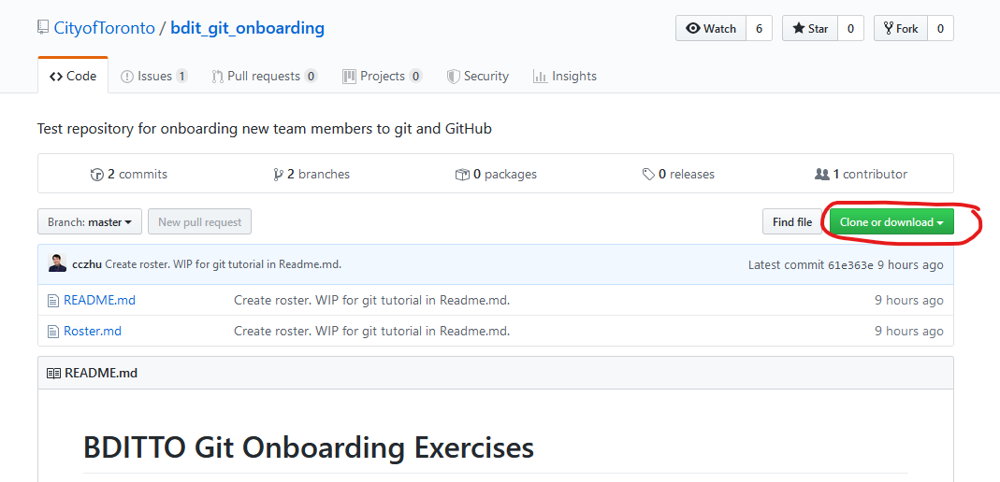
</p>

2. Select "Clone with HTTPS". Then click on the clipboard icon to copy the
repo web address to your clipboard.

<p align="center">
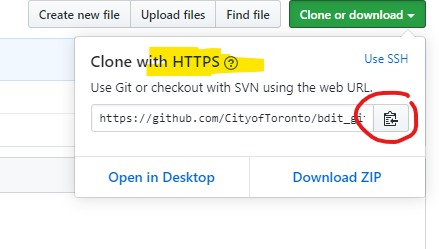
</p>

3. On the command line, go to the folder you wish to download the repo using
`cd`.  Then, use `git clone {HTTP ADDRESS}`, where `{HTTP ADDRESS}` is the
address on your clipboard.

4. Go to the `bdit_git_onboarding` folder using `cd bdit_git_onboarding`.  You
should see the contents of the repo when you use `ls` (`dir` on Windows
systems).

## Exercise 2 - create a new branch, and a new commit within it

**Next, create a new branch, and commit a change to `Roster.md`.**

1. Go to the command line, and type `git checkout -b {YOUR BRANCH NAME}`. 
`git checkout` is the command to switch between branches and commits, and the
`-b` flag creates a new branch.

2. Check that you're on the right branch by using `git branch`.  Git will
report a list of all downloaded branches, with a star beside the branch you're
on.

<p align="center">
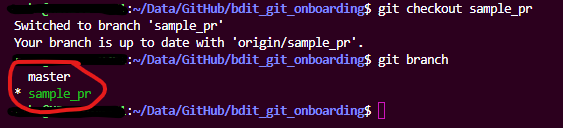
</p>

3. In the text editor of your choice, open `Roster.md` and add your GitHub
username to it.

<p align="center">
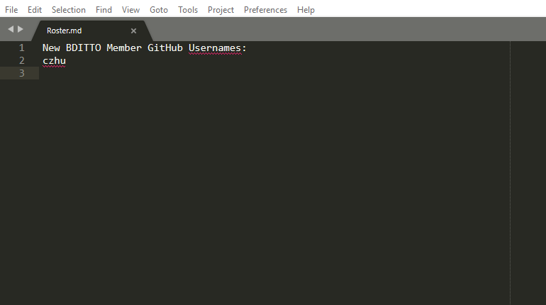
</p>

4. Check the status of your branch with `git status`.  That will show
the branch you're on, and any unsaved changes.

<p align="center">
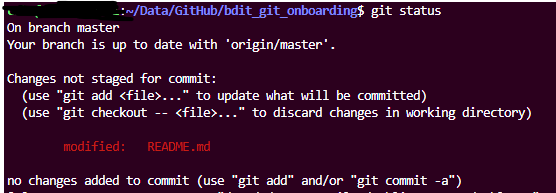
</p>

5. Save your changes to a new commit.  First tell Git to flag all your
changes to be saved with `git add -A`.  If you run `git status` afterward,
you'll see that the unsaved changes have now been "staged", meaning they'll be
included in the next commit.

<p align="center">
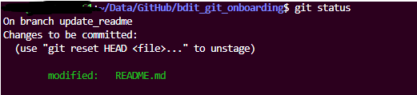
</p>

6. Now, create a new commit using `git commit -m "{YOUR COMMIT MESSAGE"}`.
Make sure your commit message is meaningful - see the Notion.so page for best
practices.  Once you've committed, run `git status` again to check that there
are no more unsaved changes.

Steps 7 and 8 are unnecessary to making a commit.  They are here to illustrate
how you can check your work after committing.

7. Check your changes using `git diff master`, which compares the current
working directory to the most recent commit of `master`.  Coloured lines
indicate differences between the two - red lines are from `master` and
green lines from the current working directory.  White lines are the same in
both branches. To quit, press `q`.

8. Check your commit messages using `git log`, which brings up the history of
commits to your branch (and any parent branches).  To quit, press `q`.

## Exercise 3 - push your changes to GitHub, and create a pull request (PR)

**Next, upload your changes to GitHub and request they be merged with
master.**

1. Type `git push -u origin {YOUR BRANCH NAME}`.  This will copy your branch
to the repo on GitHub.  The `-u` flag tells Git to begin tracking any
differences between your computer's version of the branch and GitHub's.

2. Go to the repo page on GitHub, and start a PR by clicking on the
"Pull requests" tab, and then clicking on the "New pull request" button.

<p align="center">
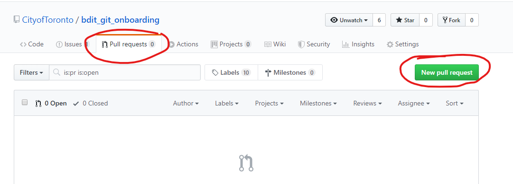
</p>

3. Select your branch in the Head Branch drop down menu.  Confirm that
"master" is the Base Branch. Then click "Create pull request".

<p align="center">
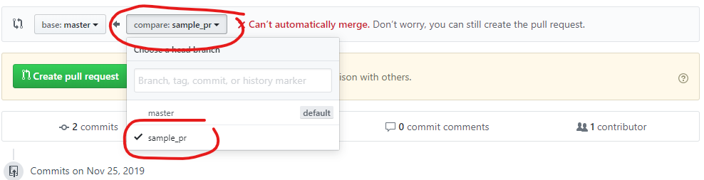
</p>

<p align="center">
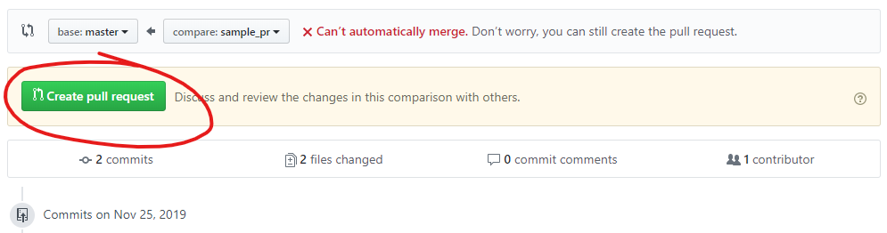
</p>

4. Fill out the PR, following [these guidelines](
https://github.com/CityofToronto/bdit_git_onboarding/pull/2).

<p align="center">
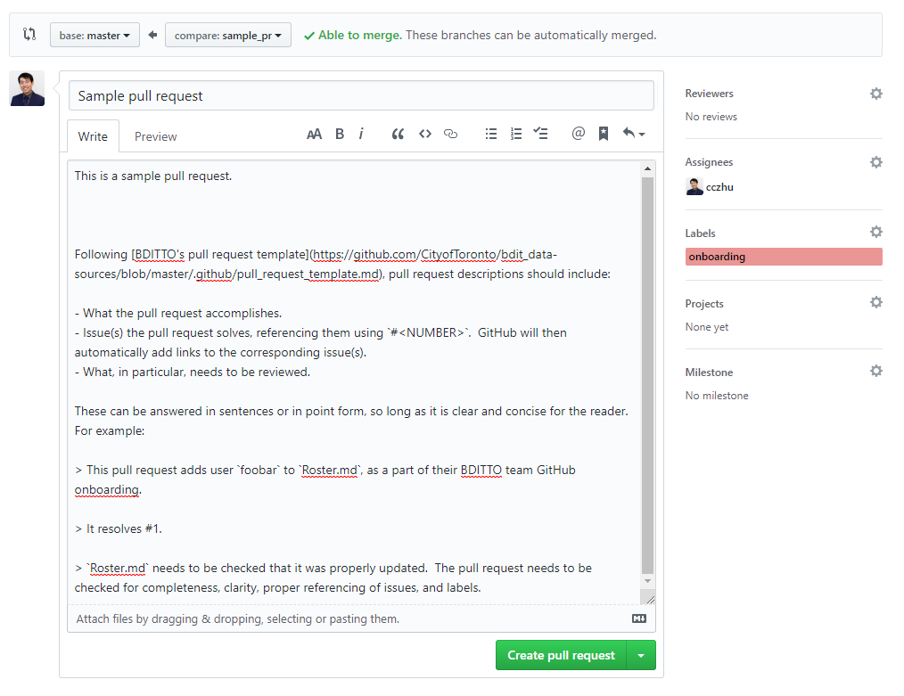
</p>

## Exercise 4 - address review comments

Following Exercise 3, your supervisor will create a review of the PR, and
request you make an additional change.

**Address these comments by updating your pull request.**

1. Redo the steps in Exercises 2 and 3 to make a new commit with those changes,
then `git push` them to GitHub.  You do not need to create a new PR - the new
commit will automatically be added to the existing PR.

2. Respond to your reviewer's comments on GitHub.

3. Once your reviewer approves the PR, they'll ask you to merge the PR.  To do
this, push the "Merge pull request" button.

<p align="center">
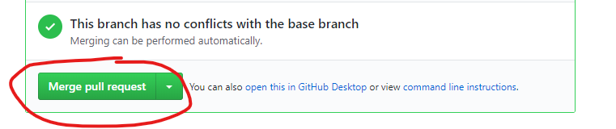
</p>

## Exercise 5 - update `master` from GitHub

**Finally, update your master branch, and delete your feature branch.**

1. On the command line, switch back to the master branch using
`git checkout master`, then use `get pull origin master` to update the branch. 
`git pull` tells Git to update a branch on your computer using the repo on
GitHub.  In this case, it's updating branch `master`.

2. Switch back to the master branch using `git checkout master` (do not add
`-b`, since this branch already exists).  You can now delete `{YOUR BRANCH
NAME}` using `git branch -D {YOUR BRANCH NAME}`.

Congratulations, you've finished the Git and GitHub onboarding exercises!
